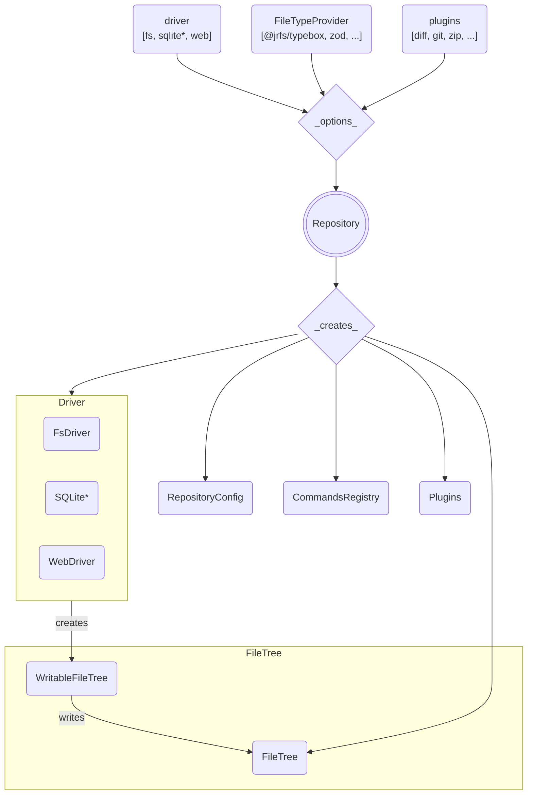

# JRFS

**JSON + Resources File System library**

JRFS is a (transactional, queryable, collaborative, caching) file system with
customizable drivers, plugins, commands, file types and schemas.

## Current Status

_Alpha - Experimental - It works for local dev so far..._

This is a work in progress.

## Overview

Here's an overview of how the innards of this beast work.

_[*] The SQLite driver does not yet exist, but the others do!_
