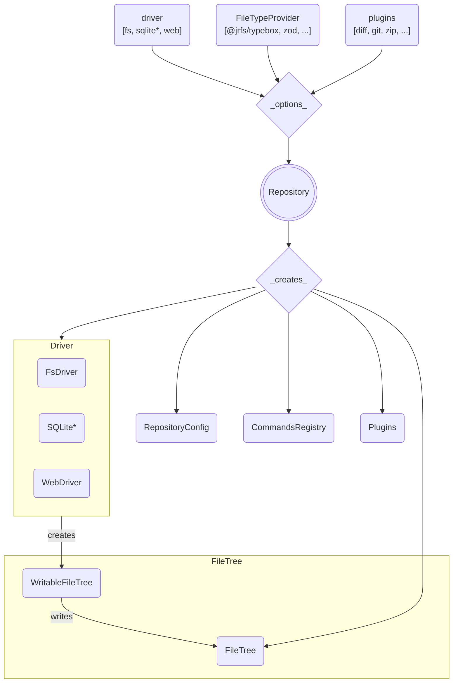

# JRFS

**JSON + Resources File System library**

JRFS is a (transactional, queryable, collaborative, caching) file system with
customizable drivers, plugins, commands, file types and schemas.

## Current Status

_Alpha - Experimental - It works for local dev so far..._

This is a work in progress.

## Things You Can Do

<details>
<summary>
Describe your file types onto an interface <code>ProjectFileTypes</code>.
</summary>

```ts
import type { FileTypeInfo } from "@jrfs/core";
import type { DbDesign } from "@/my/model/interfaces/or/someth";

/** File-types (initialize here or extend elsewhere via `declare module`) + */
interface ProjectFileTypes {
  db: DbDesignFile;
  // foo: YourFooFile;
}
/** Collection of registered project file-type specification objects. */
const ProjectFileTypes: {
  [P in keyof ProjectFileTypes]: FileTypeInfo<ProjectFileTypes[P]["meta"]>;
} = {} as any;

/** Your custom metadata for the DbDesign file type. */
interface DbDesignFileMeta {
  /** Directory layout rules. */
  dir: DirDesignMeta;
}
/** Your DbDesign file type-spec + */
const DbDesignFile: FileTypeInfo<DbDesignFileMeta> = {
  schema: DbDesign, // <-- Schema object compatible with your FileTypeProvider
  desc: "Database design",
  end: ".db.json", // <-- Match file names with this ending.
  meta: {
    dir: {
      of: {
        "tables/*": "db-table",
      },
    },
  },
};
/** DbDesign file-type data and file-type wide metadata type declaration. */
type DbDesignFile = FileType<DbDesign, DbDesignFileMeta>;

// Add our design file-type specifications to the global collection.
ProjectFileTypes.db = DbDesignFile;
```

</details>
<details>
<summary>
Create a custom <code>Repository</code> class called <code>ProjectRepo</code>.
</summary>

```ts
import { Repository } from "@jrfs/node";
import { TypeboxFileTypes } from "@jrfs/typebox";
import { ProjectFileTypes } from "demo-shared/platform/project";

export class ProjectRepo extends Repository<ProjectFileTypes> {
  constructor(configFilePath: string) {
    super({
      driver: "fs",
      fileTypes: new TypeboxFileTypes<ProjectFileTypes>().set(ProjectFileTypes),
      fs: configFilePath,
    });
  }
}
```

</details>
<details>
<summary>
Use the <code>ProjectRepo</code> to access your <code>fs</code> in your
Node server.
</summary>

```ts
const repo = new ProjectRepo(absoluteConfigFilePath);
await repo.open();

await repo.fs.write<"db">("backend/db/main/_.db.json", (data) => {
  data.db.name = "main"; // <-- Autocompletes from DbDesignFile type
  data.db.dialect = "mysql";
});

await repo.fs.rename("backend/db/main/_.db.json", "my.db.json");
```

</details>
<details>
<summary>
Serve your <code>ProjectRepo</code> to a <code>WebDriver</code> client over
web sockets.
</summary>

```ts
import { createWsServer } from "@jrfs/ws";

/** Function to call after opening repo. */
function registerSockets(repo: ProjectRepo) {
  server = createWsServer({ repo });
  server.start();
  // See labs/demo-server projectServer.ts src...
  sockets.register({
    name: "projectRepo",
    heartbeat: 12000,
    dispose,
    path: new RegExp("^" + "/" + BASE_PATH),
    wss: server.wss,
  });
}
```

</details>
<details>
<summary>
Create a matching <code>ProjectRepo</code> to access your <code>fs</code> in
the browser.
</summary>

```ts
import { createWebClient, Repository } from "@jrfs/web";
import { TypeboxFileTypes } from "@jrfs/typebox";
import { createFileCache } from "@jrfs/idb";

const client = createWebClient({
  ws: "ws://localhost:40141/sockets/v1/project/repo/fs",
});

class ProjectRepo extends Repository<ProjectFileTypes> {
  constructor() {
    super({
      driver: "web",
      web: {
        client,
        fileCache: createFileCache(),
      },
      fileTypes: new TypeboxFileTypes<ProjectFileTypes>().set(ProjectFileTypes),
    });
    (this as any)[Symbol.toStringTag] = `ProjectRepo("/project/repo/")`;
  }
}
```

</details>

<br />

The same code works on the server and client:

```ts
const repo = new ProjectRepo();

await repo.open();

await repo.fs.write<"db">("backend/db/main/_.db.json", (data) => {
  data.db.name = "main"; // <-- Autocompletes from DbDesignFile type
  data.db.dialect = "mysql";
});

await repo.fs.rename("backend/db/main/_.db.json", "my.db.json");

// Call a plugin's custom command (from next example)...
await repo.git.commit({ message: "Testing..." });
```

<details>
<summary>You can also make plugins to add custom commands.</summary>

```ts
import { CommandType, PluginType, registerPlugin } from "@jrfs/core";

export interface GitPlugin {
  add(files?: string[]): Promise<any>;
  commit(message: string): Promise<any>;
  push(force?: boolean): Promise<any>;
}

export interface GitCommands {
  "git.add": CommandType<{ files?: string[] }, { files: string[] }>;
  "git.commit": CommandType<{ message: string }, { commit: string }>;
  "git.push": CommandType<{ force?: boolean }, { commit: string }>;
}

declare module "@jrfs/core" {
  /* eslint-disable @typescript-eslint/no-unused-vars */

  interface Commands extends GitCommands {}

  interface Plugins {
    git: PluginType<undefined>;
  }

  interface Repository<FT> {
    get git(): GitPlugin;
  }

  interface RepositoryHostConfig {
    gitPath: string;
  }
  /* eslint-enable @typescript-eslint/no-unused-vars */
}

export default registerPlugin("git", function registerGitPlugin({ repo }) {
  console.log("[GIT] Registering plugin interface...");

  const plugin = Object.freeze({
    add: async (files?) => {
      console.log("[GIT] Add...");
      return repo.exec("git.add", { files });
    },
    commit: async (message) => {
      console.log("[GIT] Commit...");
      return repo.exec("git.commit", { message });
    },
    push: async (force?) => {
      console.log("[GIT] Push...");
      return repo.exec("git.push", { force });
    },
  } satisfies GitPlugin);

  Object.defineProperty(repo, "git", {
    enumerable: true,
    value: plugin,
    writable: false,
  });
});
```
</details>

<details>
<summary>
On your server, the same plugin can register custom command implementations.
</summary>

```ts
import { command, registerPlugin } from "@jrfs/core";
import registerGitPluginShared from "demo-shared/jrfs/git";
// import { simpleGit } from "simple-git";

const gitCommands = [
  command("git.add", async function gitAdd({ files, fileTypes }, params) {
    // TODO: Run git.add via simple-git...
    return { files: ["OK!"] };
  }),
  command("git.commit", async function gitCommit({ config }, params) {
    // TODO: Run git.commit via simple-git...
    return { commit: "OK!" };
  }),
  command("git.push", async function gitPush(props, params) {
    // TODO: Run git.push via simple-git...
    return { commit: "OK!" };
  }),
];

export default registerPlugin("git", function registerGitPlugin(props, params) {
  registerGitPluginShared(props, params);
  const { config, commands /*,repo*/ } = props;
  console.log("[GIT] Registering plugin host commands...");
  commands.register(gitCommands);
  config.host.gitPath = findUpGitPath(config.host.dataPath);
});
```
</details>

## Overview

Here's an overview of how the innards of this beast work.



_[*] The SQLite driver does not yet exist, but the others do!_
