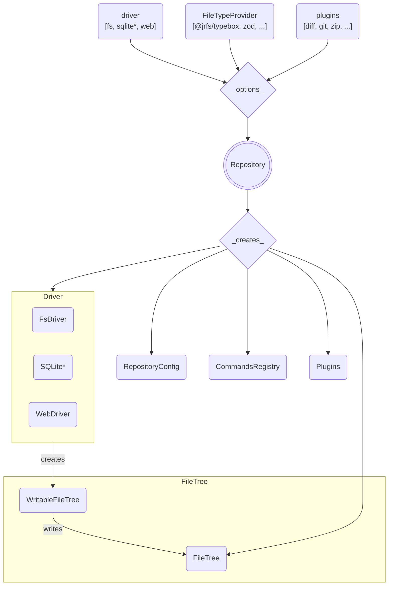

# JRFS

**JSON + Resources File System**

**JRFS** is a `[transactional|queryable|collaborative|caching]` **File System**
access library with _customizable_
`[drivers|plugins|commands|file types|schemas]`

## Current Status

**Alpha** :: _Experimental_ :: _"Works for local dev, no security!"_

### Work in Progress

- Dogfooding the current version `0.3.0` in a planned product.
- Developing `simple-git` based git integration.
- Planning a system of `Views` or "live queries" to allow developers to easily
  observe file listings and/or data in aggregate.

## Things You Can Do With JRFS

<details>
<summary style="user-select:none">
Describe your file types onto an interface
[<code>ProjectFileTypes</code>].
</summary>

<p><em>&nbsp;</em></p>

```ts
import type { FileTypeInfo } from "@jrfs/core";
import type { DbDesign } from "@/my/model/interfaces/or/someth";

/** File-types (initialize here or extend elsewhere via `declare module`) + */
interface ProjectFileTypes {
  db: DbDesignFile;
  // foo: YourFooFile;
}
/** Collection of registered project file-type specification objects. */
const ProjectFileTypes: {
  [P in keyof ProjectFileTypes]: FileTypeInfo<ProjectFileTypes[P]["meta"]>;
} = {} as any;

/** Your custom metadata for the DbDesign file type. */
interface DbDesignFileMeta {
  /** Directory layout rules. */
  dir: DirDesignMeta;
}
/** Your DbDesign file type-spec + */
const DbDesignFile: FileTypeInfo<DbDesignFileMeta> = {
  schema: DbDesign, // <-- Schema object compatible with your FileTypeProvider
  desc: "Database design",
  end: ".db.json", // <-- Match file names with this ending.
  meta: {
    dir: {
      of: {
        "tables/*": "db-table",
      },
    },
  },
};
/** DbDesign file-type data and file-type wide metadata type declaration. */
type DbDesignFile = FileType<DbDesign, DbDesignFileMeta>;

// Add our design file-type specifications to the global collection.
ProjectFileTypes.db = DbDesignFile;
```

</details>

<details>
<summary style="user-select:none">
Create a custom <code>Repository</code> class called [<code>ProjectRepo</code>].
</summary>

<p><em>&nbsp;</em></p>

```ts
import { Repository } from "@jrfs/node";
import { TypeboxFileTypes } from "@jrfs/typebox";
import { ProjectFileTypes } from "demo-shared/platform/project";

export class ProjectRepo extends Repository<ProjectFileTypes> {
  constructor(configFilePath: string) {
    super({
      driver: "fs",
      fileTypes: new TypeboxFileTypes<ProjectFileTypes>().set(ProjectFileTypes),
      fs: configFilePath,
    });
  }
}
```

</details>

<details>
<summary style="user-select:none">
Use your repo to access host files in your Node program.
</summary>

<br />
<p><em>
NOTE: Please open a discussion if you're interested in helping with a
compatible Go or Rust library!
</em></p>

```ts
const repo = new ProjectRepo(absoluteConfigFilePath);
await repo.open();

await repo.fs.write<"db">("backend/db/main/_.db.json", (data) => {
  data.db.name = "main"; // <-- Autocompletes from DbDesignFile type
  data.db.dialect = "mysql";
});

await repo.fs.rename("backend/db/main/_.db.json", "my.db.json");
```

</details>

<details>
<summary style="user-select:none">
Serve the host file system to browsers over web sockets.
</summary>

<br />
<p><em>
Using our lightweight ws integration... Other libraries and 
channel-types (e.g. REST/gRPC) are also possible.
</em></p>

```ts
import { createWsServer } from "@jrfs/ws";

/** Function to call after opening repo. */
function registerSockets(repo: ProjectRepo) {
  server = createWsServer({ repo });
  server.start();
  // See labs/demo-server projectServer.ts src...
  sockets.register({
    name: "projectRepo",
    heartbeat: 12000,
    dispose,
    path: new RegExp("^" + "/" + BASE_PATH),
    wss: server.wss,
  });
}
```

</details>

<details>
<summary style="user-select:none">
Create a matching client <code>ProjectRepo</code> to connect from the browser.
</summary>

<br />
<p><em>And sprinkle in an optional IndexedDB based file cache...</em></p>

```ts
import { Repository, createWebClient } from "@jrfs/web";
import { TypeboxFileTypes } from "@jrfs/typebox";
import { createFileCache } from "@jrfs/idb";

const client = createWebClient({
  ws: "ws://localhost:40141/sockets/v1/project/repo/fs",
});

class ProjectRepo extends Repository<ProjectFileTypes> {
  constructor() {
    super({
      driver: "web",
      fileTypes: new TypeboxFileTypes<ProjectFileTypes>().set(ProjectFileTypes),
      web: {
        client,
        fileCache: createFileCache(),
      },
    });
    (this as any)[Symbol.toStringTag] = `ProjectRepo("/project/repo/")`;
  }
}
```

</details>

<br />

The same code works on the server and client:

```ts
const repo = new ProjectRepo();

await repo.open();

await repo.fs.write<"db">("backend/db/main/_.db.json", (data) => {
  data.db.name = "main"; // <-- Autocompletes from DbDesignFile type
  data.db.dialect = "mysql";
});

await repo.fs.rename("backend/db/main/_.db.json", "my.db.json");

// Call a custom plugin command... (see plugin commands demo)
await repo.git.commit({ message: "Testing..." });

// Find all files that match a registered file type along with the
// data that's been retrieved and cached in memory for that file.
const files = await repo.findTypes("db");
for (const { node, data } of nodes) {
  console.log("FOUND", node.name, "{ id:", [node.id], "} =", data);
}
```

<details>
<summary style="user-select:none">
Make a plugin to <em>DECLARE</em> and <strong>expose</strong> some custom
commands...
</summary>

<br />
<p><em>
...but implement them somewhere else, not here, in this example.
</em></p>

```ts
import { CommandType, PluginType, registerPlugin } from "@jrfs/core";

export interface GitPlugin {
  add(files?: string[]): Promise<any>;
  commit(message: string): Promise<any>;
  push(force?: boolean): Promise<any>;
}

export interface GitCommands {
  "git.add": CommandType<{ files?: string[] }, { files: string[] }>;
  "git.commit": CommandType<{ message: string }, { commit: string }>;
  "git.push": CommandType<{ force?: boolean }, { commit: string }>;
}

declare module "@jrfs/core" {
  /* eslint-disable @typescript-eslint/no-unused-vars */

  interface Commands extends GitCommands {}

  interface Plugins {
    git: PluginType<undefined>;
  }

  interface Repository<FT> {
    get git(): GitPlugin;
  }

  interface RepositoryHostConfig {
    gitPath: string;
  }
  /* eslint-enable @typescript-eslint/no-unused-vars */
}

export default registerPlugin("git", function registerGitPlugin({ repo }) {
  console.log("[GIT] Registering plugin interface...");

  const plugin = Object.freeze({
    add: async (files?) => {
      console.log("[GIT] Add...");
      return repo.exec("git.add", { files });
    },
    commit: async (message) => {
      console.log("[GIT] Commit...");
      return repo.exec("git.commit", { message });
    },
    push: async (force?) => {
      console.log("[GIT] Push...");
      return repo.exec("git.push", { force });
    },
  } satisfies GitPlugin);

  Object.defineProperty(repo, "git", {
    enumerable: true,
    value: plugin,
    writable: false,
  });
});
```

</details>

<details>
<summary style="user-select:none">
The <em>server</em> module of your plugin can register command implementations.
</summary>

<br />
<p><em>
NOTE: Commands can be implemented anywhere (client, server, library).
</em></p>

```ts
import { simpleGit } from "simple-git";
import { command, registerPlugin } from "@jrfs/core";
import registerGitPluginShared from "demo-shared/jrfs/git";

/**
 * Command implementations may be registered on any layer (client/server).
 * Drivers are responsible for executing commands or forwarding them.
 */
const gitCommands = [
  command("git.add", async function gitAdd({ files, fileTypes }, params) {
    // TODO: Run git.add via simple-git...
    return { files: ["OK!"] };
  }),
  command("git.commit", async function gitCommit({ config }, params) {
    // TODO: Run git.commit via simple-git...
    return { commit: "OK!" };
  }),
  command("git.push", async function gitPush(props, params) {
    // TODO: Run git.push via simple-git...
    return { commit: "OK!" };
  }),
];

registerPlugin("git", function registerGitPlugin(props, params) {
  // Call our shared plugin setup to declare and expose custom commands.
  registerGitPluginShared(props, params);
  // Register the actual command implementations..
  const { config, commands /*,repo*/ } = props;
  console.log("[GIT] Registering plugin host commands...");
  commands.register(gitCommands);
  config.host.gitPath = findUpGitPath(config.host.dataPath);
});
```

</details>

## Overview

Here's an overview of how the innards of this beast work.



_[*] The SQLite driver does not yet exist, but the others do!_
